<div align="center">


<br><br>

[](https://asif.is-a.dev)
[](https://linkedin.com/in/your-linkedin)
[](mailto:asifmohammed4000@gmail.com)

</div>

---

## 🧑‍💻 About Me


```python
class Asif:
    def __init__(self):
        self.role       = "Full Stack Developer"
        self.focus      = ["Backend Architecture", "Scalable APIs", "Cloud"]
        self.languages  = ["Python", "C", "C++", "JavaScript"]
        self.stack      = ["Django", "FastAPI", "React", "Docker", "AWS"]
        self.databases  = ["PostgreSQL", "MongoDB", "Redis"]
        self.fuel       = "☕ coffee"

    def current_focus(self):
        return "Building production-ready, scalable systems"
```

- 🔭  Full Stack Developer turning ideas into scalable, production-ready systems
- ⚙️  From crafting REST APIs to deploying containerized microservices
- 🌱  Exploring distributed systems, message queues & cloud-native tooling
- 💬  Ask me about **Django, FastAPI, System Design & Docker**

<br clear="right"/>

---

## 🛠️ Tech Stack

<div align="center">

<table>
<tr>
<td align="center" width="96"><strong>Languages</strong></td>
<td>


</td>
</tr>
<tr>
<td align="center"><strong>Backend</strong></td>
<td>


</td>
</tr>
<tr>
<td align="center"><strong>Frontend</strong></td>
<td>


</td>
</tr>
<tr>
<td align="center"><strong>Data &amp; Queues</strong></td>
<td>


</td>
</tr>
<tr>
<td align="center"><strong>Cloud &amp; DevOps</strong></td>
<td>


</td>
</tr>
</table>

</div>

---

## 📊 GitHub Analytics

<div align="center">



<br>


</div>

---

## 📈 Contribution Graph

<div align="center">


</div>

> 💡 The graph above renders your **real contribution history** automatically — commits, PRs, issues, and streaks update live from your GitHub activity.

---

## 🐍 Watch My Contributions Get Eaten

<div align="center">


<sub>⚙️ One-time setup needed — add the <a href="https://github.com/Platane/snk">Platane/snk</a> GitHub Action to your <code>Asif404</code> repo to generate this animated snake from your real contribution grid.</sub>

</div>

---

## 🤝 Let's Connect

<div align="center">

<a href="https://linkedin.com/in/your-linkedin"></a>&nbsp;&nbsp;
<a href="mailto:asifmohammed4000.gmail.com"></a>&nbsp;&nbsp;
<a href="https://asif.is-a.dev"></a>&nbsp;&nbsp;

<br><br>

<i>⭐️ From <a href="https://github.com/Asif404">Asif404</a> — thanks for stopping by!</i>


</div>
